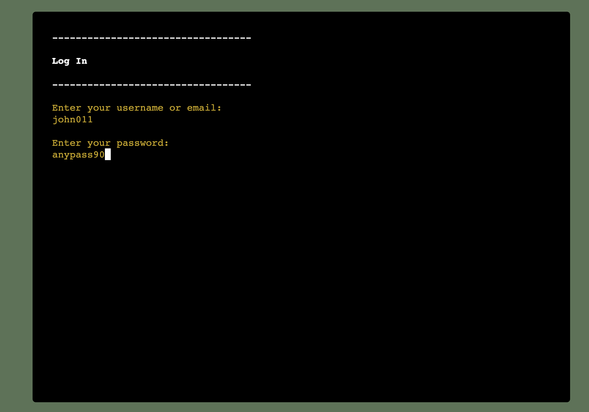
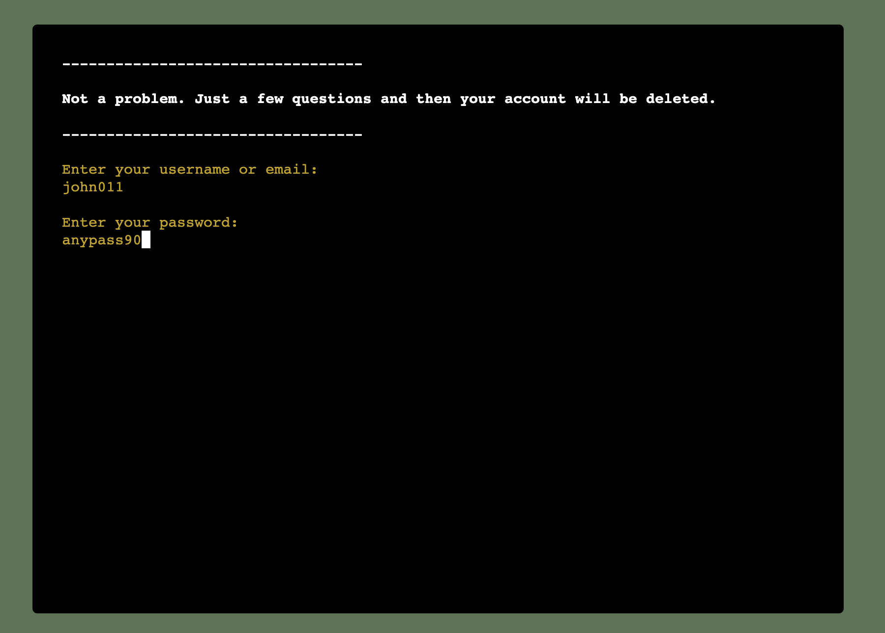
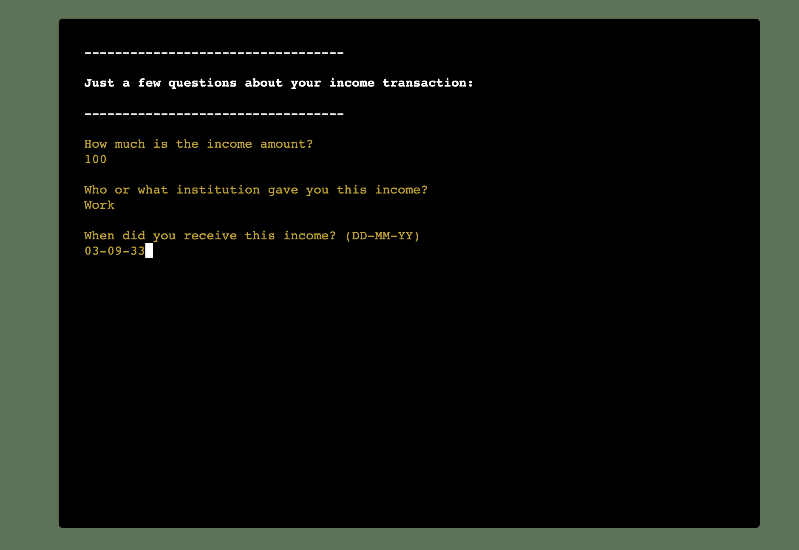
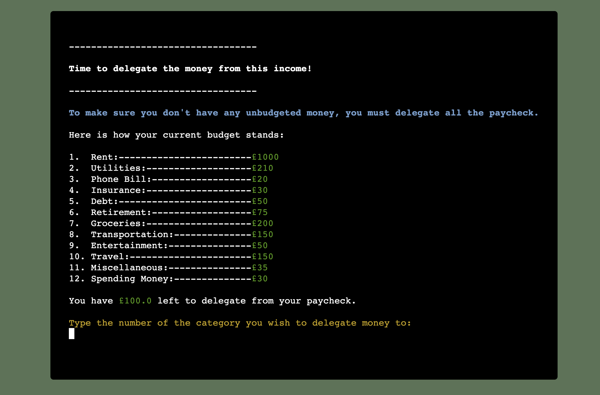
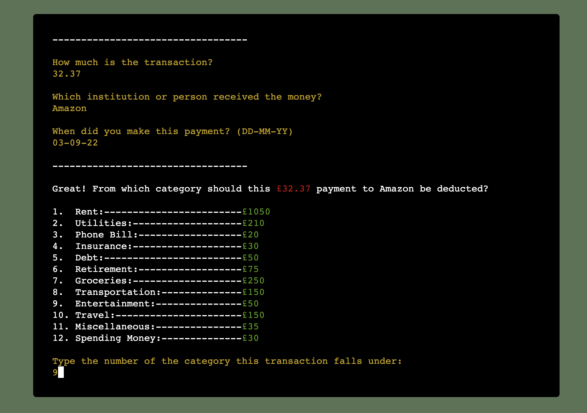
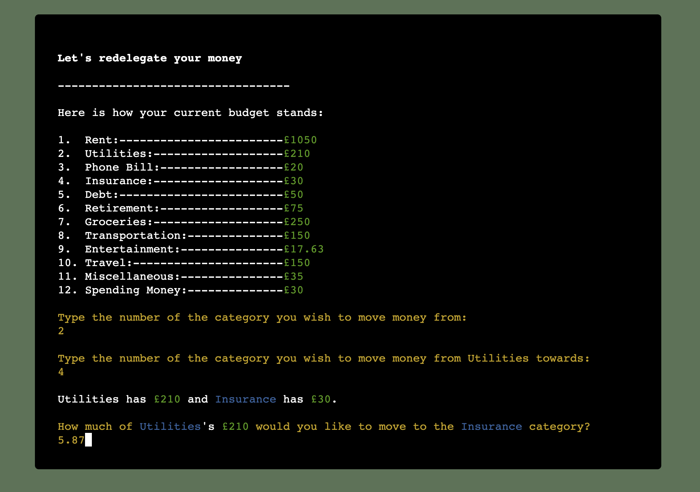
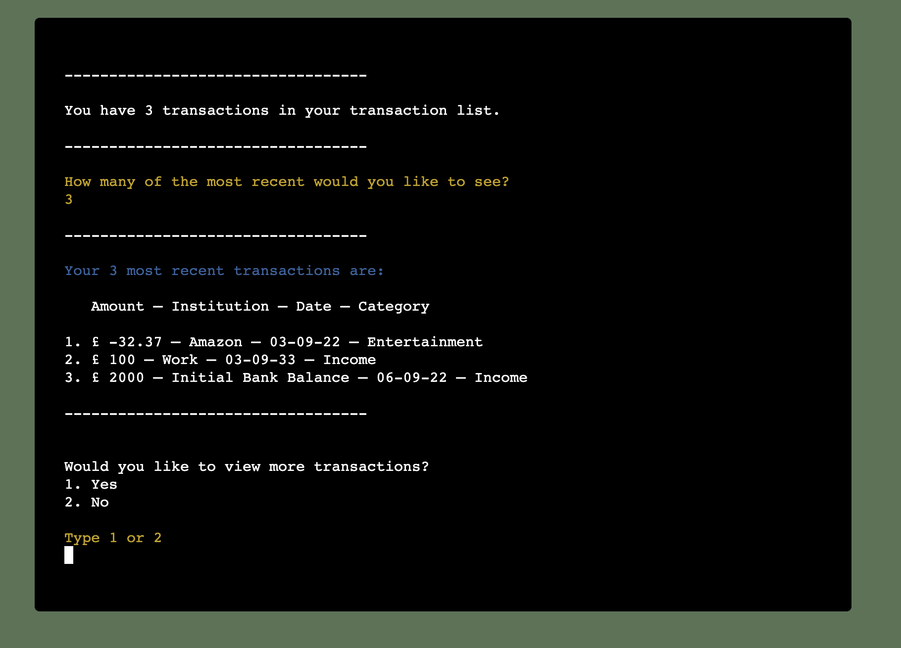
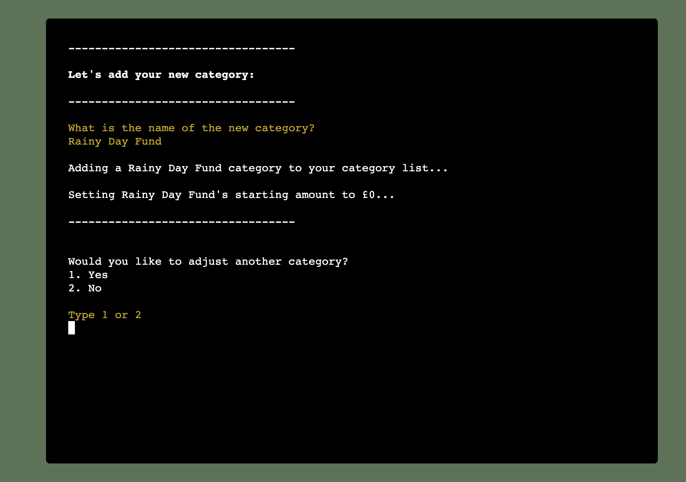
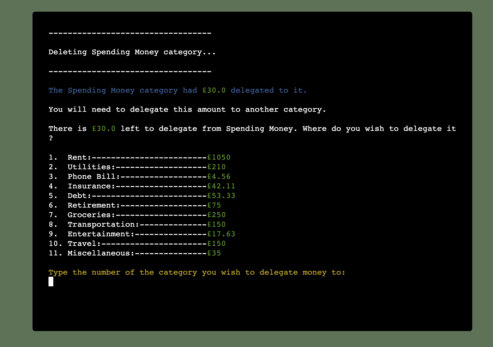
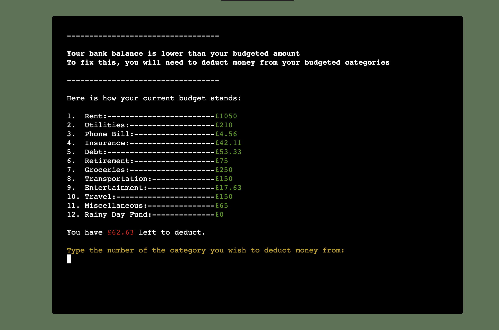

# Welcome to Commandline BudgetApp

The deployed webapp can be accessed [here](https://commandline-budgetapp.herokuapp.com).

Commandline BudgetApp is a simple bugdeting app which operates in a terminal. The app allows users to create an account, set up a budget and keep track of their money through an easy to use budgeting portal. The impetus for this app was my own frustration with all current budgeting apps either being too complicated (and thus, discouraging to use) or trying to incorporate other aspects of my finances which I would like to control separately (such as investing). Consequently, Commandline BudgetApp focuses solely on keeping track of expenses and helping you delegate money. 

Using the app is simple, as the user simply needs to 1.) make sure that the total budgeted amount is equivalent to that of their bank balance, 2.) log each income and payment transaction, and 3.) follow the app's prompts and questions.

Additional features include allowing the user to create an account which they can log back into at any point, to delete their account if they wish and to opt for a prebuilt budget or build their own. Once the user has created their budget, they can input transactions, move money around their budget, view recent transactions, add or delete budget categories and update their budget to match their bank account balance. This app aims to provide a simple solution to keeping track of the user's finances.

# Features

## Start Screen

At the start of the app, the user is presented with 4 options: 
1. Log in
2. Create an account
3. Delete my account
4. Quit App

### Login

The login prompts the user to enter their username and password. If the entries are correct, the user is directed to the Home Dashboard (see below).

### Create Account

The Create Account route prompts the user to enter their future login details. It then prompts the user to set up their budget (see below), either from a preset budget or by building their own. Finally, the user is prompted to insert their bank account balance and make their first set of delegations. Once this process is complete, the user is then directed to their newly created budget's home dashboard.

#### Setup Budget

### Delete Account

At any point, the user is able to delete their account. They will need to input their username or email and their password. Once validated, their account will be permanently deleted.

### Quit App

By selecting the Quit App option, the user ends the application script and thus closes out of the application. To restart the app, the user can either refresh the page or click the button above the terminal which says "Restart App".

## Home Dashboard

The Home Dashboard is the central place to execute the budgeting tasks. The user is provided with 7 options:

1. Add an Income Transaction
2. Add a Payment Transaction
3. Redelegate/Move Money Around
4. View Recent Transactions
5. Add or Delete Categories
6. My Bank Balance Doesn't Match the Budgeted Amount
7. Log out

### Add Income Transaction

If the user opts to add an income transaction, they will be guided through a series of questions which gather details about the nature of the income transaction and then prompts them to delegate every pound from their income. The income transaction will then be logged into the transaction list.

### Add Payment Transaction

If the user opts to add a payment transaction, they will be guided through a series of questions which gather details about the nature of the payment transaction and which category it belongs to. The app will then deduct the transaction amount from that category and log the transaction in the transaction list.

### Redelegate 

If the user opts to redelegate, the user will be able to move money between categories.

### View Recent Transactions

If the user opts to view their recent transactions, they will be notified of how many transactions there are in their transaction list. They will then be prompted to indicate how many of the most recent transactions they would like to see. The app will then print their desired amount of recent transactions.

### Add or Delete Categories

If the user opts to adjust their categories, the app will guide them through the process of either adding a new budget category or deleting one (and consequently rebudgeting any money that the deleted category had).

### Adjust Budget to Match Bank Balance

If the user has forgotten to budget for a while and their current bank account doesn't match the budgeted amount, they can select the option to update their bank balance. This will then calculate whether they need to add or deduct money from the budget and will prompt the user to do accordingly.

### Log Out

Once the user is finished budgeting, they can log out of the app by pressing '7' in the home dashboard. This will log them out and restart the app.

## Possible Future Features:
- Select desired currency
- Budgeting for couples (multiple users on the same budget account)

# Testing

I have tested the deployed app on Google Chrome, Safari, Firefox, Microsoft Edge and Vivaldi. I can confirm that the app works on all of these web browsers.

I have manually tested the app by doing the following:

1. Passing the code through a PEP8 linter and can confirm that the code passed with no problems
2. Given invalid inputs throughout the app to test the app's ability to handle incorrect inputs
3. Allowed two other people (my wife, Megan, and my friend, Michael) to attempt to break the code by inserting incorrect entries throughout. After several modifications and debugging sessions, the code was able to withstand incorrect inputs throughout and redirect the user to enter a correctly formated input.
4. Tested the app in my local terminal and in the Code Institute Heroku terminal

## Bugs

### Solved Bugs
1. When I began the project, I had not planned to make the app allow different users to create their own accounts. But after conversations about the functionality of the app with my mentor, I decided to create this functionality to allow the users to manage their own budget.
2. The budget was initially only able to handle integers. Upon realising the problematic nature of a budget only able to handle full pounds, I converted all variables handling currencies to floats and rounded them to the nearest 2 decminals to more accurately represent currency. 

### Remaining Bugs
- I am not aware of any remaining bugs.

## Validator Testing
- PEP8:
    - No errors were returned from http://pep8online.com

# Deployment
This project is deployed using Code Institute's mock terminal for Heroku.

Steps for Deployment:
1. Fork or Clone this Depository
2. Set up Google Sheets and Google Drive APIs 
3. Download the Key json file from Google, upload it to the project. Change the name to creds.json
4. Create a new Google Sheet named 'commandline-budgetapp'
5. Add label one worksheet 'users'
6. Create new Heroku app
7. Set the buildpacks to python and node.js (in that order) 
8. Link the Heroku app to the repository
9. Click Deploy

# Comments
Due to Google Sheets limiting the number of worksheets in a single Google Sheet to 200, this app could only handle, at most, 99 users.

# Credits
- Deployment aesthetic:
    - Color theme came from Adobe color
- Concept:
    - The concept of this budget is entirely my own. I took inspiration from financial theories such as those which emphasise budgeting every dollar
- Code: 
    - For how to avoid line lengths that produce errors, I followed [this Stack Overflow thread](https://stackoverflow.com/questions/53162/how-can-i-do-a-line-break-line-continuation-in-python)
    - For various questions on Python syntax, I used [docs.python.org](https://docs.python.org)
    - For various questions on how to use the gspread dependency, I followed the instructions outlined on [docs.gspread.org](https://docs.gspread.org/en/latest/index.html)
    - For the Regex expression used to validate email inputs, I followed [this article's](https://www.geeksforgeeks.org/check-if-email-address-valid-or-not-in-python/) suggestions
    - For advice on formating datetime, I implemented code from [this article](https://www.programiz.com/python-programming/datetime/current-datetime)
    - I used [this article's](https://www.quicken.com/blog/budget-categories) outline of standard budget items to guide my creation of the preset budget
    - Much of this project incorporates code and techniques learned from Code Institute's walkthrough project 'Love Sandwiches'
- Individuals:
    - My Mentor, [Adegbenga Adeye](https://github.com/deye9), provided comments and feedback
    - My wife, Megan, and my friend, Michael, both rigorously tested the site and provided feedback
