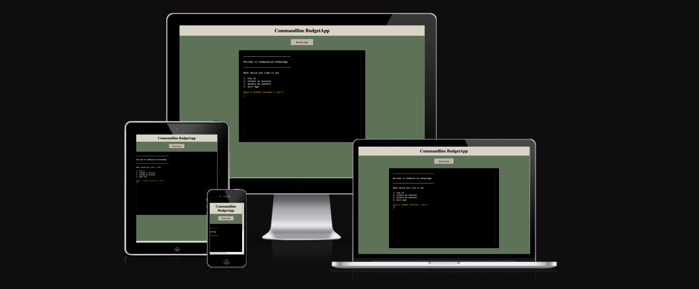
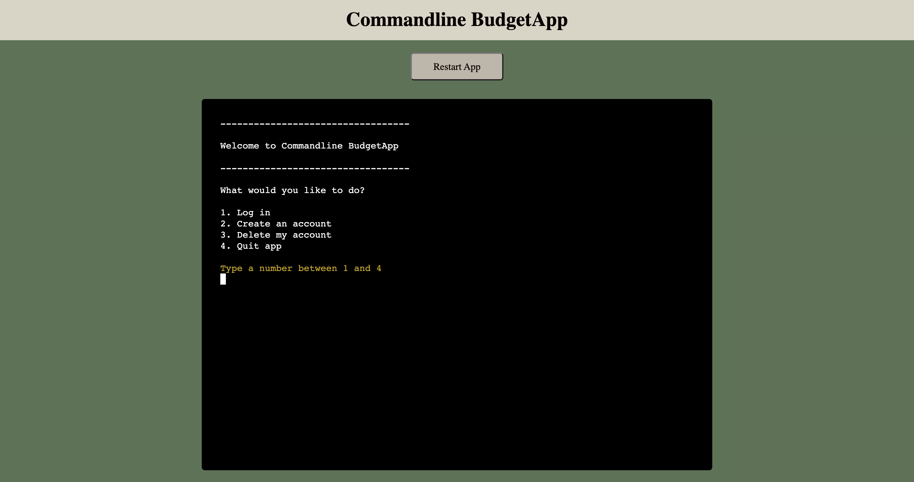
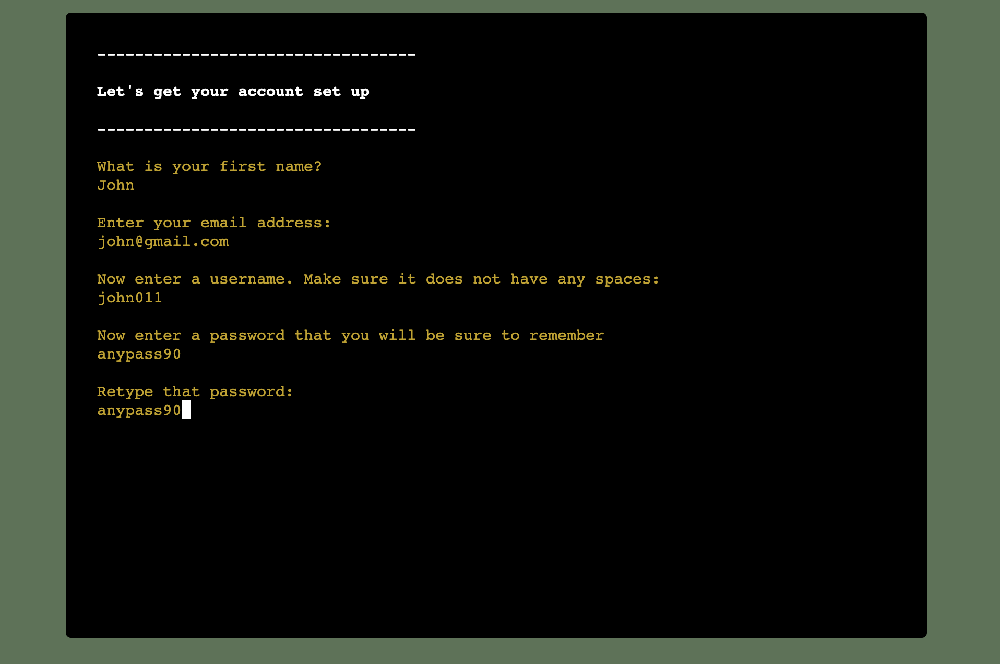
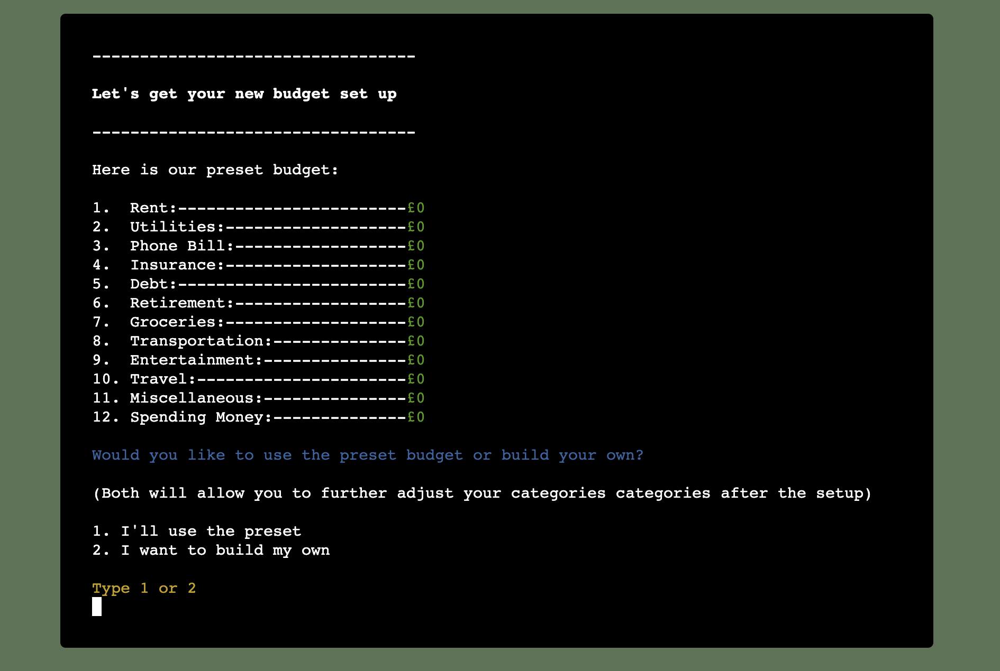
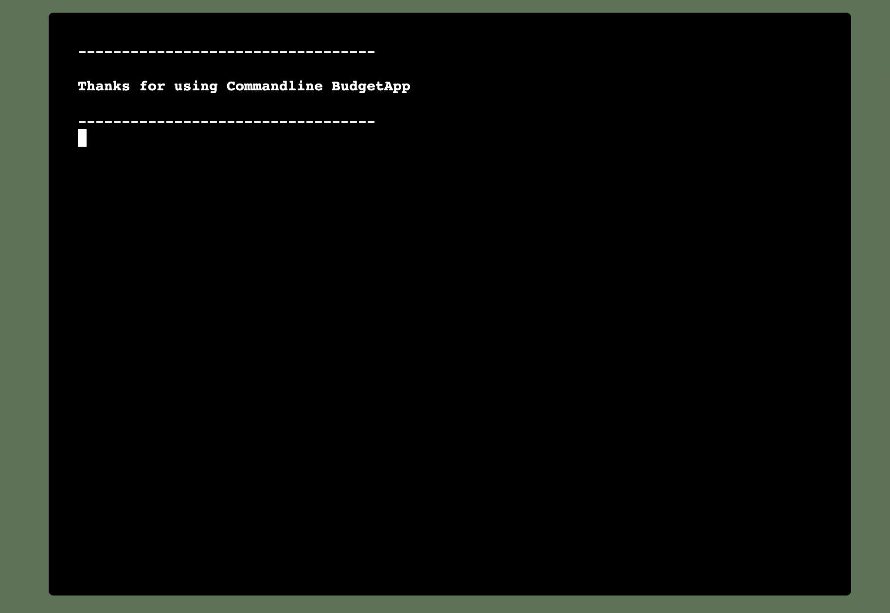
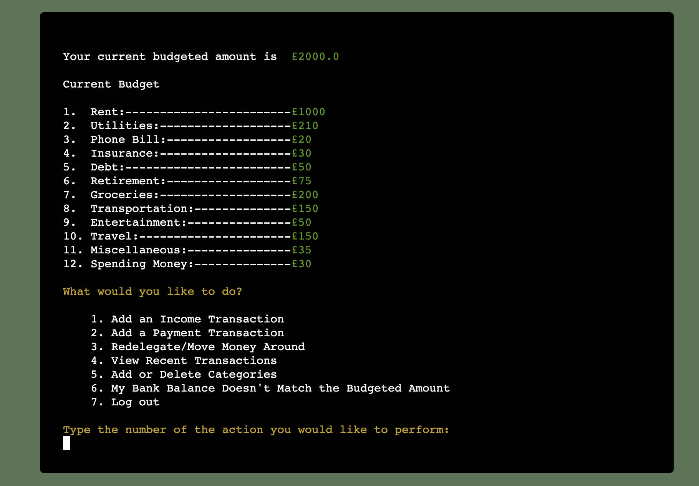

# Welcome to Commandline BudgetApp

Commandline BudgetApp is a simple bugdeting app which operates in a terminal. The app allows users to create an account, set up a budget and keep track of their money through an easy to use budgeting portal. The impetus for this app was my own frustration with all current budgeting apps either being too complicated (and thus, discouraging to use) or trying to incorporate other aspects of my finances which I would like to control separately (such as investing). Consequently, Commandline BudgetApp focuses solely on keeping track of expenses and helping you delegate money. 

Using the app is simple, as the user simply needs to 1.) make sure that the total budgetd amount is equivalent to that of their bank balance, 2.) log each income and payment transaction, and 3.) follow the app's prompts and questions.

Additional features include: allowing the user to create an account which they can log back into at any point, allowing the user to delete their account if they wish and allowing users to opt for a prebuilt budget or build their own. Once the user has created their budget, they can input transactions, move money around their budget, view recent transactions, add or delete budget categories and update their budget to match their bank account balance. It is hoped that this app provides a simple solution to keeping track of the user's finances.

# Features

## Start Screen

### Login

### Create Account

#### Setup Budget

### Delete Account

### Quit App

## Home Dashboard

### Add Income Transaction

### Add Payment Transaction

### Redelegate 

### View Recent Transactions

### Add or Delete Categories

### Log Out

## Future Features